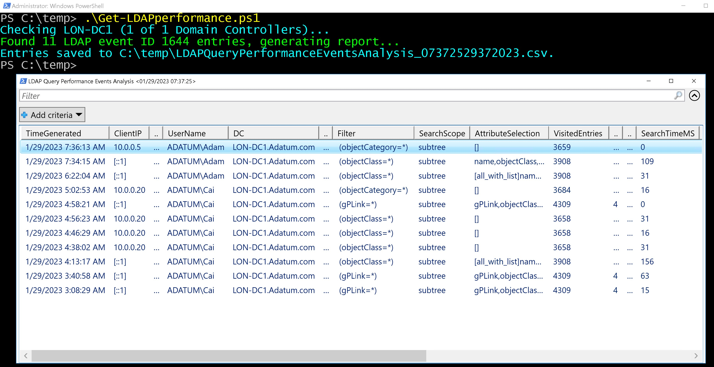

# Get-LDAPperformance
Collects LDAP Query Performance Events and analyzes them to CSV & Grid. Helps in identifying large or unusual LDAP queries, either for Threat Hunting or IT optimization.

by 1nTh35h311 (comments to yossis@protonmail.com)

NOTE: No Dependencies. No modules required. Requires Event Log Readers permission or equivalent (privileged/access to DC 'directory Services' logs)

1. First, you need to enable 'DS Access - Directory Services Access' in GPO for auditing

2. If the following Reg Key does not exist locally on all Domain Controllers - please create it:

Set-ItemProperty HKLM:\SYSTEM\CurrentControlSet\Services\NTDS\Diagnostics -Name "15 Field Engineering" -Value 5

NOTE: to stop logging these events in "Directory Services" Log, set the registry key value to 0

